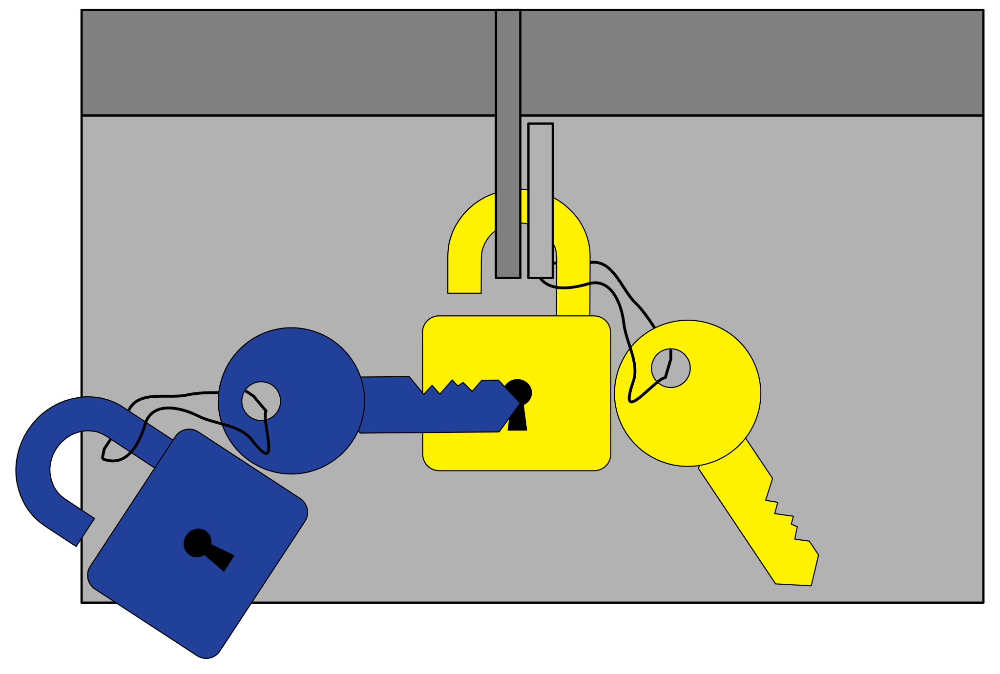

# Asymmetrisches Kryptosystem - Public-Private-Key-Verfahren

Das Asymmetrische Kryptosystem, auch als Public-Private-Key-Verfahren bekannt, wird für die verschlüsselte Nachrichtenübermittlung oder für digitale Unterschriften verwendet. Die Besonderheit liegt in der Verwendung eines Schlüsselpaars, wobei ein Schlüssel nur verschlüsselt und der andere zugehörige Schlüssel nur entschlüsselt oder umgekehrt. Der selbe Schlüssel kann die von ihm verschlüsselte Nachricht nicht wieder entschlüsseln. Das kann nur der jeweils andere Schlüssel.

Die Idee ist nun einen der beiden Schlüssel zu veröffentlichen. Diesen kann nun jeder nutzen um eine Nachricht an den Inhaber des zugehörigen privaten Schlüssels zu verschlüsseln. Nur dieser kann die Nachricht wieder entschlüsseln. Nicht einmal der Versender der Nachricht kann sie wieder entschlüsseln. Es ist daher ratsam den Klartext der Nachricht aufzubewahren!

## Verschlüsseln einer Nachricht

Wir können das anhand eines Vorhängeschlosses veranschaulichen. Der öffentliche Schlüssel ist das Gegenstück zum private Schlüssel. In unserem Beispiel ist der öffentliche Schlüssel gelb. Der private Schlüssel hat die Komplementärfarbe Blau. Beide Farben zusammen heben sich gegenseitig auf, die Nachricht ist entschlüsselt. 

Das gelbe Vorhängeschloss ist öffentlich zugänglich. Will jemand dem Besitzer des blauen Schlüssels eine Nachricht verschlüsselt zukommen lassen, legt er die Nachricht in eine Kiste, welche er mit dem Vorhängeschloss verschließt. Im Set mit dem Schloss ist zwar auch ein gelber Schlüssel enthalten, dieser kann das Schloss aber nicht aufschließen. Mathematisch ist der gelbe Schlüssel das selbe Objekt wie das gelbe Vorhängeschloss. Beide Symbole beschreiben nur eine unterschiedliche Verwendung. 

Der Empfänger öffnet das Schloss mit seinem blauen Schlüssel und kann die Nachricht lesen.

## Digitale Unterschrift

Angenommen der Empfänger möchte den Absender darüber informieren, dass er die Nachricht erhalten hat. Jeder könnte einfach eine Antwort an den Absender zurückschicken. Der Absender weiß nicht, dass sie vom richtigen Empfänger stammt. Der Empfänger der Nachricht kann jedoch die Bestätigung ebenfalls mit seinem privaten Schlüssel verschlüssen, also das blaue Vorhängeschloss an die Kiste hängen. Nun kann jeder mit dem gelben Schlüssel das blaue Vorhängeschloss öffnen. Das ist der Beweis, dass die Bestätigung wirklich vom Empfänger der ursprünglichen Nachricht stammt.

Diese umgekehrte Richtung beschreibt das Prinzip der digitalen Signatur bzw. digitalen Unterschrift. Der Empfänger wird in seiner Bestätigung die kryptografische Prüfsumme (Hashwert) der ursprünglichen Nachricht mitschicken, damit die Bestätigung auch wirklich eindeutig fälschungssicher zugeordnet werden kann. Des Weiteren kann aus der Prüfsumme die geheime Nachricht nicht mehr hergestellt werden.