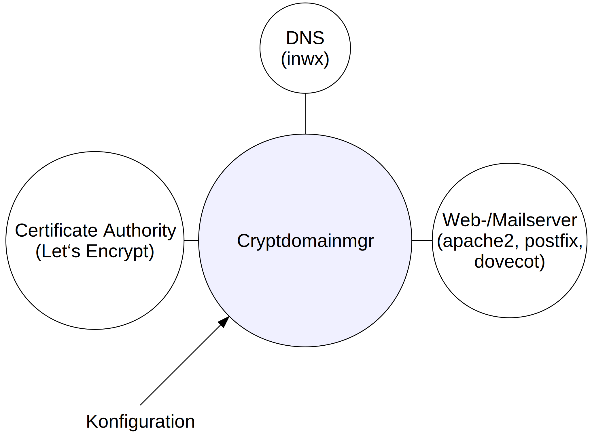

# Cryptdomainmgr


| Projektdaten |
| ------------- | --------------------------------------------------------------- |
| Logo |  |
| Quellcode | [https://github.com/TheTesla/cryptdomainmgr](https://github.com/TheTesla/cryptdomainmgr) |
| Paket        | [https://pypi.org/project/cryptdomainmgr/](https://pypi.org/project/cryptdomainmgr/) |
| Lizenz       | AGPLv3 |


_Cryptdomainmgr_ ist ein Python-Programm, welches TLS-Zertifikate, TLSA-Domaineinträge und DKIM-Schlüssel automatisch erneuert.

Das Verfahren "DNS-Based Authentication of Named Entities" (DANE) koppelt TLS-Zertifikate über Hashwerte (TLSA-Einträge) an die DNS-Zone. Im Falle einer kompromittierten Zertifizierungsstelle (CA) kann über den DNS-Eintrag die Richtigkeit des Zertifikates nachgewiesen werden. An unberechtigte Dritte ausgestellte Zertifikate werden entlarvt. Die DNS-Zone darf jedoch nicht kompromittiert sein und sollte per DNSSEC abgesichert werden.

Um den Versand betrügerischer E-Mails zu erschweren, signieren Mailserver E-Mails mit mit einem DKIM-Schlüssel. Die Signatur kann über den DKIM-Eintrag in der Absenderdomain validiert werden. Das Fälschen der Absenderdomain wird dadurch entdeckt.

Die asymmetrischen Schlüsselpaare für die DKIM-Signatur und TLS-Zertifikate müssen regelmäßig erneuert werden, um den Angriffszeitraum bei gebrochenen Schlüsseln gering zu halten.

_Cryptdomainmgr_ erneuert die Schlüssel sowie DH-Parameter automatsich lückenlos ohne Downtime in drei Phasen: Prepare, Rollover, Cleanup. Auch negative Caching stellt dadurch kein Problem dar.

## Aufbau

Der _Cryptdomainmgr_ wird auf das System installiert, auf welchem der Web- oder Mailserver-Dienst läuft. Softwaremodule kommunizieren mit den externen Komponenten. Momentan können TLS-Zertifikate nur von _Let's Encrypt_ bezogen werden. Der DNS-Anbieter _Internetworx_ stellt eine API bereit, über welche die DNS-Einträge aktualisiert werden können. Zum Erzeugen der DKIM-Schüssel und zum Signieren wird _rspamd_ verwendet. Die Zertifikate werden den Mailserver-Diensten _postfix_ und _dovecot_ sowie dem Webserver _apache2_ zur Verfügung gestellt.

Um weitere DNS-Server, Zertifikatsanbieter und Dienste zu unterstützen kann _Crypdomainmgr_, ohne Änderungen am Hauptprogramm vornehmen zu müssen, mit entsprechenden Softwaremodulen erweitert werden. 



## Installation

Auf _Debian 9_ oder _Ubuntu 18.04_ sind mehrere Installationsschritte erforderlich. Die Software wird über _pypi_ bereitgestellt. Da der zugehörige Paketmanager _pip_ keine Abhängigkeiten über _apt_ nachinstalliert, müssen diese zuerst manuell installiert werden:

```bash
apt install -y libcurl4-openssl-dev libssl-dev
```

Um Zertifikate bei _Let's Encrypt_ abzuholen wird _curl_ benötigt:

```bash
apt install -y curl
```

Für die Erzeugung der DKIM-Schlüssel und zur DKIM-Signierung muss noch _rspamd_ installiert werden:

```bash
apt install -y lsb-release wget # optional
CODENAME=`lsb_release -c -s`
wget -O- https://rspamd.com/apt-stable/gpg.key | apt-key add -
echo "deb [arch=amd64] http://rspamd.com/apt-stable/ $CODENAME main" > /etc/apt/sources.list.d/rspamd.list
echo "deb-src [arch=amd64] http://rspamd.com/apt-stable/ $CODENAME main" >> /etc/apt/sources.list.d/rspamd.list
apt update
apt install -y rspamd
```

Nun fehlt nur noch das eigentliche Programm:

```bash
python2 -m pip install cryptdomainmgr
```

## Nutzung

Die gesamte Konfiguration erfolgt über Dateien im ini-Format. Die Einträge können über mehrere Dateien verteilt werden. Bei Konflikten gilt immer der Eintrag der letzten Datei.

### Verwalten von IP-Adressen im DNS

Für den Zugriff auf die API des Domainhosters müssen Zugangsdaten angegeben werden. Zumindest das Passwort sollte in einer extra Datei liegen. Bspw. die Datei ``/etc/cryptdomainmgr/credentials.conf``:

```
[domain]
handler = dnsuptools/inwx
user = myUsename
passwd = myPassword1234
```

Diese Angaben gelten grundsätzlich für alle verwalteten Domains. Abweichende Daten können auch für jede Domain einzeln hinterlegt werden.

Jetzt kann die Konfiguration für die erste Domain angelegt werden, bspw. die Datei ``/etc/cryptdomainmgr/mydomains.conf``:

```
[domain:test1234.entroserv.de]
ip4 = auto
ip6 = auto
```

Die Minimalkonfiguration ist fertig. Sie hinterlegt die IPv4- und die IPv6-Adresse, über welche der Server extern erreichbar ist, automatisch im DNS. Die IP-Adressen werden durch Aufruf von [ip4.icanhazip.com](http://ip4.icanhazip.com) bzw. [ip6.icanhazip.com](http://ip6.icanhazip.com) ermittelt. Die Ermittlung der IP-Adressen und das Eintragen im DNS wird durch Aufruf von: 

```bash
python2 -m cryptdomainmgr --update /etc/cryptdomainmgr/*.conf 
```

einmal ausgeführt.

Alternativ kann der Inhalt der Konfiguration auch direkt als Argument übergeben werden:

```bash
python2 -m cryptdomainmgr --update /etc/cryptdomainmgr/inwxcred.conf --config-content $'[domain:test1234.entroserv.de] \n handler=dnsuptools/inwx \n ip4=auto'
```

Wichtig ist das ``$``-Zeichen, damit die ``\n`` als Zeilenumbruch interpretiert werden. In diesem Beispiel liegen die Zugangsdaten für _inwx_ in ``/etc/cryptdomainmgr/inwxcred.conf``.

Die Log-Ausgabe des Programms, sollte, wenn alles richtig funktioniert, ungefähr so aussehen:

```
[2019-02-03 16:07:22,496]    INFO      Interpreting config sections
[2019-02-03 16:07:22,496]    INFO        - cdm
[2019-02-03 16:07:22,497]    INFO        - domain
[2019-02-03 16:07:22,634]    INFO      Running phase: update
[2019-02-03 16:07:22,634]    INFO      Create resource records for section "test1234.entroserv.de"
[2019-02-03 16:07:24,144]    INFO      add (exists) A for test1234.entroserv.de : 92.60.36.246
```

Es wird sogar angezeigt, dass der Eintrag in identischer From schon vorhanden ist. Beim erstmaligen Ausführen steht dort: ``add (new) ...``.

Sollte bereits ein alter, nicht mehr gültiger, Eintrag vorhanden sein, wird auch der Löschvorgang protokolliert:

```
[2019-02-03 16:24:04,441]    INFO      Interpreting config sections
[2019-02-03 16:24:04,442]    INFO        - cdm
[2019-02-03 16:24:04,442]    INFO        - domain
[2019-02-03 16:24:04,598]    INFO      Running phase: update
[2019-02-03 16:24:04,599]    INFO      Create resource records for section "test1234.entroserv.de"
[2019-02-03 16:24:07,241]    INFO      add (new) A for test1234.entroserv.de : 92.60.36.246
[2019-02-03 16:24:08,273]    INFO      delete A for test1234.entroserv.de : 1.2.3.4
```
Mehrere Einträge können mit Komma getrennt angegeben werden:

```bash
python2 -m cryptdomainmgr --update /etc/cryptdomainmgr/inwxcred.conf --config-content $'[domain:test1234.entroserv.de] \n handler=dnsuptools/inwx \n ip4=1.2.3.4,5.6.7.8,auto'
```

Die Einträge werden einzeln angelegt. Als letztes werden wieder alte Einträge entfernt:

```
[2019-02-03 16:35:18,958]    INFO      Interpreting config sections
[2019-02-03 16:35:18,958]    INFO        - cdm
[2019-02-03 16:35:18,959]    INFO        - domain
[2019-02-03 16:35:19,108]    INFO      Running phase: update
[2019-02-03 16:35:19,108]    INFO      Create resource records for section "test1234.entroserv.de"
[2019-02-03 16:35:20,947]    INFO      add (exists) A for test1234.entroserv.de : 1.2.3.4
[2019-02-03 16:35:21,774]    INFO      add (new) A for test1234.entroserv.de : 5.6.7.8
[2019-02-03 16:35:22,878]    INFO      add (new) A for test1234.entroserv.de : 92.60.36.246
[2019-02-03 16:35:24,237]    INFO      delete A for test1234.entroserv.de : 6.7.8.9
```

Soll ein Eintrag hinzugefügt werden, ohne schon vorhandene Einträge zu entfernen, muss der ``+=``-Operator verwendet werden:

```
python2 -m cryptdomainmgr --update /etc/cryptdomainmgr/inwxcred.conf --config-content $'[domain:test1234.entroserv.de] \n handler=dnsuptools/inwx \n ip4+=6.5.4.3'
```

Die Ausgabe bestätigt, es wird nichts gelöscht:

```
[2019-02-03 16:39:50,893]    INFO      Interpreting config sections
[2019-02-03 16:39:50,894]    INFO        - cdm
[2019-02-03 16:39:50,894]    INFO        - domain
[2019-02-03 16:39:51,042]    INFO      Running phase: update
[2019-02-03 16:39:51,043]    INFO      Create resource records for section "test1234.entroserv.de"
[2019-02-03 16:39:53,004]    INFO      add (new) A for test1234.entroserv.de : 6.5.4.3
```

Es ist auch möglich einen Eintrag einfach nur zu löschen bzw. sicherzustellen, dass für diese Domain kein A-Record hinterlegt ist:

```bash
python2 -m cryptdomainmgr --update /etc/cryptdomainmgr/inwxcred.conf --config-content $'[domain:test1234.entroserv.de] \n handler=dnsuptools/inwx \n ip4=none'
```

Die Ausgabe bestätigt den Löschvorgang. Es wird auch nichts hinzugefügt:

```
[2019-02-03 16:41:38,424]    INFO      Interpreting config sections
[2019-02-03 16:41:38,425]    INFO        - cdm
[2019-02-03 16:41:38,425]    INFO        - domain
[2019-02-03 16:41:38,570]    INFO      Running phase: update
[2019-02-03 16:41:38,570]    INFO      Create resource records for section "test1234.entroserv.de"
[2019-02-03 16:41:40,469]    INFO      delete A for test1234.entroserv.de : 1.2.3.4
[2019-02-03 16:41:40,634]    INFO      delete A for test1234.entroserv.de : 5.6.7.8
[2019-02-03 16:41:40,801]    INFO      delete A for test1234.entroserv.de : 92.60.36.246
[2019-02-03 16:41:40,959]    INFO      delete A for test1234.entroserv.de : 6.5.4.3
```

Für IPv6 sind die Beispiele equivalent anwendbar:

```bash
python2 -m cryptdomainmgr --update /etc/cryptdomainmgr/inwxcred.conf --config-content $'[domain:test1234.entroserv.de] \n handler=dnsuptools/inwx \n ip6=auto,abcd::ef'
```

Jetzt werden die AAAA-Records entsprechend gesetzt:

```
[2019-02-03 17:06:29,903]    INFO      Interpreting config sections
[2019-02-03 17:06:29,903]    INFO        - cdm
[2019-02-03 17:06:29,904]    INFO        - domain
[2019-02-03 17:06:30,096]    INFO      Running phase: update
[2019-02-03 17:06:30,097]    INFO      Create resource records for section "test1234.entroserv.de"
[2019-02-03 17:06:32,029]    INFO      add (exists) AAAA for test1234.entroserv.de : 2a03:4000:33:f1:d8d0:f6ff:fec1:7039
[2019-02-03 17:06:32,676]    INFO      add (new) AAAA for test1234.entroserv.de : abcd::ef
[2019-02-03 17:06:33,846]    INFO      delete AAAA for test1234.entroserv.de : ef80::01
```

### TLS-Zertifikate einrichten

Wir haben bereits gelernt, wie alle Einstellungen über die ini-Datei(en) erfolgen. Hier werden auch die Zertifikate festgelegt. Soll ein Zertifikat für eine oder mehrere Doamin verwendet werden, muss dieses in einem Zertifikats-Abchnitt beschrieben und in den gewünschten Domain-Abschnitten referenziert werden. Das folgende Besipiel, nennen wir die Konfigurationsdatei ``/etc/cryptdomainmgr/mycert.conf``, erzeugt zwei Zertifikate mit den internen Bezeichnungen _maincert_ und _noocspcert_:

```
[cert]
handler = dehydrated
keysize = 4096
certname = fullchain.pem
email = stefan@entroserv.de
destination = /etc/ssl

[cert:maincert]
extraflags = --ocsp

[cert:noocspcert]
extraflags = 
```

Der Konfigruation legt für alle Zertifikate die Nutzung des Clients _dehydrated_ fest. Dieses Programm beantragt über die _acme_-Schnittstelle ein nes Zertifikat bei _Let's Encrypt_. Es ist einen Alternative zum weitaus bekannteren _certbot_. Wir wollen zeitgemäße 4096-Bit-Schlüssel verwenden. Die Zertifikatsdatei soll _fullchain.pem_ heißen. Sie enthält alle erforderlichen Zwischenzertifikate und wird von Servern wie _apache_ oder _postix_ verwendet. Die E-Mail-Adresse bezieht sich auf das Konto bei _Let's Encrypt_. Im Zielpfad ``/etc/ssl`` werden automatisch Unterordner für die jeweilige Domain angelegt.

Es wird ein Zertifikat _maincert_ mit _ocsp_-Eintrag erstellt und ein Zertifikat _noocspcert_ ohne _ocsp_-Eintrag. Die Zertifikate müssen jetzt noch den Domains zugeordnet werden:

```
[domain:test1234.entroserv.de]
ip4 = auto
ip6 = auto
cert = maincert

[domain:test4321.entroserv.de]
ip4 = auto
ip6 = auto
cert = maincert

[domain:imap1234.entroserv.de]
ip4 = auto
ip6 = auto
cert = noocspcert
```

Die beiden Domains _test1234.entroserv.de_ und _test4321.entroserv.de_ verwenden das Zertifikat mit OCSP. Das können bspw. Webdomains sein. Da ein Zertifikat für zwei Domains verwendet wird, müssen auch beide im Zertifikat eingetragen sein. Es entsteht daher automatisch ein sog. _SAN_-Zertifikat (_Subject Alternative Name_).

Es werden zwar die beiden Dateien ``/etc/cryptdomainmgr/test1234.entroserv.de/fullchain.pem`` und ``/etc/cryptdomainmgr/test4321.entroserv.de/fullchain.pem``. Es handelt sich jedoch um die gleiche Datei.

Für unsere E-Mail-Domain ``imap1234.entroserv.de`` nutzen wir ein Zertifikat ohne OCSP, weil _Thunderbird_ kein OCSP unterstützt. Dieses Zertifikat ist unter ``/etc/cryptdomainmgr/imap1234.entroserv.de/fullchain.pem`` zu finden.

Die Konfiguration für _apache2_ ist dann bspw.:

```
<VirtualHost *:443>
  SSLEngine on
  SSLUseStapling on
  DocumentRoot /var/www/test1234/
  Header always set Strict-Transport-Security "max-age=63072000; includeSubdomains;"
  SSLCertificateFile /etc/ssl/test1234.entroserv.de/fullchain.pem
  SSLCertificateKeyFile /etc/ssl/test1234.entroserv.de/privkey.pem
  ServerName test1234.entroserv.de
  <Directory /var/www/test1234>
    Order allow,deny
    allow from all
  </Directory>
</VirtualHost>
```

Die Konfiguration des Webservers benötigt nur die Domain und den zugehörigen Ordner. Jetzt ist offensichtlich, warum Cryptdomainmgr die Zertifikate für jede Domain kopiert.

Natürlich muss der apache-Dienst die neuen Zertifikate laden. Deshalb muss die Konfiguration noch:

```
[service:apache2]
dummy = dummy
```

enthalten. Der Parameter ``dummy`` ist nur erforderlich, weil die Programmbibliothek zum Lesen der ini-Datei immer mindestens einen Parameter je Abschnitt braucht. 

Jetzt muss Cryptdomainmgr nur noch ausgeführt werden. Da die Zertifikate in drei Phasen _prepare_, _rollover_ und _cleanup_ übernommen werden, muss Cryptdomainmgr bei Neukonfiguration drei mal ausgeführt werden:

```bash
python -m cryptdomainmgr --next /etc/cryptdomainmgr/mycert.conf /etc/cryptdomainmgr/inwxcred.conf
```

Anstatt ``--update`` steht hier ``--next``. Dieses Flag führt die jeweils nächste Phase aus. Alternativ können die Phasen auch explizit ausgeführt werden:

```bash
python -m cryptdomainmgr --prepare /etc/cryptdomainmgr/mycert.conf /etc/cryptdomainmgr/inwxcred.conf
python -m cryptdomainmgr --rollover /etc/cryptdomainmgr/mycert.conf /etc/cryptdomainmgr/inwxcred.conf
python -m cryptdomainmgr --cleanup /etc/cryptdomainmgr/mycert.conf /etc/cryptdomainmgr/inwxcred.conf
```

Aber woher weiß Cryptdomainmgr welche die vorherige Phase war? Dafür gibt es die _state.json_-Datei standardmäßig unter ``/var/cryptdomainmgr/state.json``

Werden auch die Zertifikate für _Postfix_ und _Dovecot_ erneuert, müssen auch diese das jeweils neue Zertifikat laden:

```
[service:postfix]
dummy = dummy

[service:dovecot]
dummy = dummy
```

### CA-Auswahl beschränken mit CAA

Schließlich entscheidet man sich für eine CA, welche ein Zertifikat für die Domain ausstellt. Wir können daher einer CA das Ausstellen von Zertifikaten für diese Domain explizit erlauben und es allen anderen CAs verbieten. Dafür gibt es den sog. _CAA_-Record. Um _Letsencrypt_ für _pserver.entroserv.de_ zu erlauben benötigen wir den CAA-Eintrag: ``0 issue "letsencrypt.org"`` vom Typ ``CAA`` unter ``pserver.entroserv.de``. 

Cryptdomainmgr vereinfacht die Konfiguration:

```
[domain:pserver.entroserv.de]
ip4 = auto
ip6 = auto
tlsa.tcp = auto:3:1:1,auto:2:0:1
cert = maincert
caa = auto
```

Weil wir mit ``cert = maincert`` bereits die Zertifikatskonfiguration verknüpft haben, braucht Cryptdomainmgr nur noch dort nachschauen, welcher handler bzw. welche CA verwendet wird und den passenden CAA-Eintrag hinzufügen. Er ist statisch und wird daher im Update-Zyklus veröffentlicht.


### TLSA-Einträge veröffentlichen

Der Hashwert des jeweiligen Zertifikates kann im DNS veröffentlicht werden. Die Echtheit des Zertifikats wird über die beschränkten Schreibrechte auf die DNS-Zone nachgewiesen. Es kann dadurch zukünftig auf eine offizielle CA verzichtet werden.

Um die TLSA-Einträge im DNS zu veröffentlichen, ist ein Eintrag unter ``domain`` notwendig: 

```
[domain:test1234.entroserv.de]
ip4 = auto
ip6 = auto
cert = maincert
tlsa.tcp.443 = auto:3:1:1, auto:2:0:1
```

Der im Beispiel angegebene TLSA-Eintrag gilt für ``TCP``-Verbindungen über Port ``443``.  Er wird ``auto``matisch aus dem ``maincert``-Zertifikat generiert. Die Flags ``3:1:1`` bedeuten: ``3`` -- nur das Zertifikat ohne Trustchain soll geprüft werden, ``1`` -- nur der öffentliche Schlüssel fließt in den TLSA-Eintrag ein, ``1`` -- und zwar als sha256-Hashwert. Ein zweiter TLSA-Eintrag bestimmt das CA-Zertifikat (``2``), wobei das gesamte Zertifikat (``0``) einfließt, welches wieder in Form eines sha256-Hashwertes (``1``) repräsentiert ist.

Soll der TLSA-Eintrag für alle Ports gelten, dann kann die Portangabe einfach weggelassen werden.

Die Veröffentlichung der TLSA-Einträge erfolgt bereits in der prepare-Phase. Die cleanup-Phase entfernt die alten Einträge. Im Beispiel werden dabei nur Einträge für das ``tcp``-Protokoll auf Port ``443`` entfernt. Diese Notation erlaubt es für unterschiedliche Dienste auf der selben Domain separate Instanzen des _cryptdomainmgr_ einzusetzen, z. B. in getrennten Containern oder VMs.

### DKIM einrichten

Ausgehende E-Mails sollen mit dem DKIM-Verfahren (DomainKeys Identified Mail) signiert werden. Ein asymmetrisches Schlüsselpaar, bestehend aus einem öffentlichen und einem ptrivaten Schlüssel stellt die Korrektheit des sendenden Servers sicher. Der private Schlüssel signiert die E-Mail. Der zugehörige öffentliche Schlüssel liegt im DNS. Angenommen der Empfänger erhält eine E-Mail mit der Absenderadresse _info@entroserv.de_, dann wird er unter _entroserv.de_ den öffentlichen Schlüssel abrufen und die Signatur prüfen. 

Der Schlüssel liegt allerdings nicht unmittelbar unter _entroserv.de_, sondern bspw. unter _key\_1551615065.\_domainkey.entroserv.de_. Der Selektor _key\_1551615065_ erlaubt das lückenlose Wechseln der Schlüssel. Im DKIM-Header der E-Mail ist der Selektor eingetragen. Ist die E-Mail also mit dem einen Schlüssel signiert, der Schlüssel wird gerade gegen einen neuen ersetzt, und erst jetzt kommt die E-Mail beim empfangenden Server an, so kann dieser anhand des darin enthaltenen Selektors den passenden alten Schlüssel zuordnen.

Für die Konfoguration von DKIM ist wieder ein eigener Abschnitt ``[dkim]`` in die Konfiguration des _crryptdomainmgr_ einzufügen. Es sind, wie bereits bei den TLS-Zertifikaten, mehrere unterschiedliche benamte Konfigurationen erlaubt.

Die DKIM-Schlüssel sollen von ``rspamd`` generiert und genutzt werden. Der aktuelle Selektor soll in `` /etc/rspamd/local.d/dkim_signing.conf`` geschrieben werden. Diese Option kann weggelassen werden, da diese Einstellung die Grundeinstellung ist. 

```
[dkim:maindkim]
handler = rspamd
signingConfDestinationFile = /etc/rspamd/local.d/dkim_signing.conf
```

Der öffentliche DKIM-Schlüssel soll im DNS veröffentlicht werden. Wir ergänzen daher unsere Domainkonfiguration, indem wir eine Verknüpfung zur DKIM-Konfiguration herstellen: ``dkim = auto:maindkim``

```
[domain:test1234.entroserv.de]
ip4 = auto
ip6 = auto
cert = maincert
dkim = auto:maindkim
tlsa.tcp.443 = auto:3:1:1, auto:2:0:1
```

_Rspamd_ signiert die ausgehenden E-Mails automatisch. Natürlich muss mit jedem Schlüsseltausch Rspamd neugestartet werden:

```
[service:rspamd]
dummy = dummy
```

Leider hat Rspamd noch einen Fehler. Ein ``systemctl reload rspamd`` startet neue Prozesse anstatt die Konfiguration neu zu laden. Deshalb wird Rspamd mit ``systemctl restart rspamd`` neugestartet. Der Befehl ``rspamadm control reload`` lädt die Konfiguration auch nicht neu. Er hat keine Funktion und wird bald entfernt.

Noch einmal zur Erinnerung: Der Konfigurationseintrag ``dkim = auto:maindkim`` muss bei allen Domainkonfigurationen vorhanden sein, welche der Absender-E-Mail-Domains entsprechen. Beispiel: Der E-Mail-Server heißt _pserver.entroserv.de_, versendet aber eine E-Mail mit der Absenderadresse _info@entroserv.de_, dann muss _entroserv.de_ für DKIM konfiguriert sein. Cryptdomainmgr fügt dann den DKIM-Record für diese Domain hinzu: _key_1557831495._domainkey.entroserv.de_, wobei der Selektor im Beispiel zufällig gewählt ist.

### Weitere Records für den E-Mail-Dienst

Einige wichtige DNS-Records wurden bisher noch nicht besprochen. Im vorangegangenen Beispiel hatten wir eine von der Serverdomain getrennte E-Mail-Domain. Diese werden über den _MX_-Record verknüpft. Unter ``èntroserv.de`` muss in unserem Beispiel ein DNS-Eintrag vom Typ ``MX`` angelegt werden, welcher auf ``pserver.entroserv.de`` zeigt. Dieser Eintrag wird für den Empfang von E-Mails benötigt. Der sendende Server will eine E-Mail an _info@entroserv.de_ schicken. Er schaut auf _entroserv.de_ nach, was im MX-Record für ein Server eingetragen ist. Efr weiß nun, dass er die E-Mail an den Server _pserver.entroserv.de_ übertragen muss. Um eine höhere Verlässlichkeit und Leistungsfähigkeit zu erreichen, können mehrere MX-Records angegeben werden, die auf unterschiedliche Server verweisen. 
