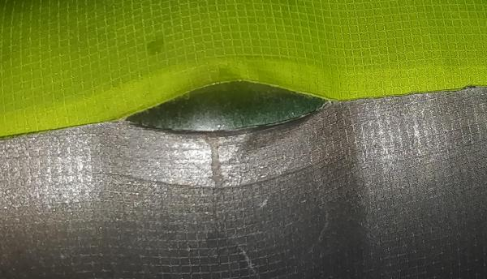
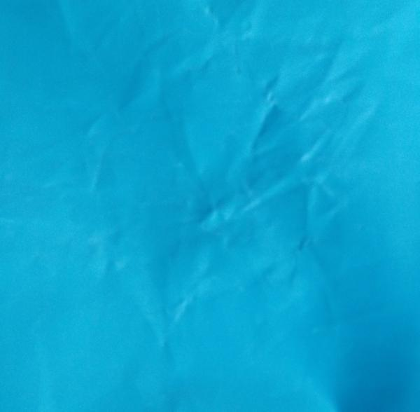
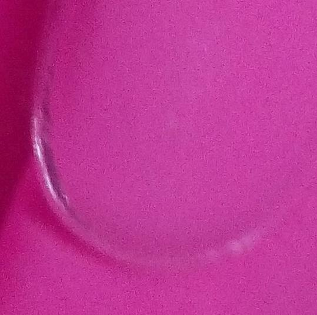

# Komfort-Luftbett ohne geplante Obsoleszenz

Zur Indiegogo-Kampagne: https://www.indiegogo.com/projects/high-quality-durable-comfort-airbed-with-pillow/coming_soon

Hast Du dir schon einmal eine dieser teuren Camping-Luftmatratzen gekauft, bist auf den Zeltplatz gefahren und hast versucht einige Nächte darauf zu schlafen? Neben der Tatsache, dass die meisten Camping-Luftmatratze einfach zu klein und unbequem sind, halte sie selten lange. Einige verlieren schon nach einer Nacht erheblich Luft. Das trift häufig auch auf die schwereren Luftbetten, welche eher als Gästebetten bestimmt sind, zu. 

Die Bewertungen von Luftbetten und Camping-Matratzen auf Marktportalen ähneln häufig einer Badewannenkurve. Die 5-Sterne-Bewertungen sind nichtssagend neutral und klingen wie gekauft. Die 1-Sterne-Bewertungen zeigen, dass das Produkt **Schrott** ist:

* "sehr starker chemischer Geruch"
* "Das Luftbett hat leider nur ganze 6 Nächte durchgehalten"
* "Das Material hat sich um ca 33 Prozent ausgedehnt"
* "Beschichtung gelöst"

Dabei ist unklar, ob es sich um geplante Obsoleszenz handelt oder einfach nur um schlechte Qualität, vielleicht aus Kostengründen.

## Kurze Lebensdauer wegen Konstruktionsfehlern

Viele Luftbetten haben mehrere Designschwächen, welche der Lebensdauer abträglich sind:

* minderwertiges Material, z. B. PVC mit schlechtem Weichmacher
* zu dünne Folie
* Verbundstoffe (beschichtetes Polyester-Gewebe) mit zu dünner gasdichter Beschichtung meist sogar aus minderwertigem PVC
* Beschichtung des Polyestergewebes ist zu schlecht verbunden und löst sich ab
* geklebte Nähte aus ungeeignetem Klebstoff
* zu dünne Schweißnähte
* harter Übergang zu festen Elementen wie Ventilen, dadurch hohe Bruchgefahr des Materials

### Verbundmaterial

Folgendes Bild zeigt das Problem der Verbundstoffe. Nehmen wir an, Polyestergewebe (1 und 4) mit einer dünnen TPU-Beschichtung (2 und 3) wird verschweißt. (organge Linie zeigt Schweißnaht) Die dünne TPU-Schicht ist zwar sehr elastisch, aber nicht sehr zugfest. Das dickere Polyestergewebe ist zwar sehr zugfest aber wenig elastisch. Der Verbundstoff soll idealerweise elastisch und zugfest sein. In der Praxis funktioniert die Kombination nicht immer.

Das Material ist im Beispiel rechtwinklig nach außen gezogen. Der äußere Biegeradius befindet sich innen, d. h. auf der Seite der Schweißnaht bzw. TPU-Schicht. Weil TPU sehr elastisch ist, nimmt diese Schicht nur wenig der Zugkraft auf. Die meiste Kraft nimmt das Polyestergewebe. Da dieses Gewebe eine sehr geringe Elastizität hat, konzentriert sich fast die gesamte Kraft auf der längeren Seite der Biegung, da dort das Material am stärksten gedehnt ist. Die hohe Zugspannung ist im Bild mit langen Pfeilen visualisiert.

Auch in der Schweißnaht konzentriert sich die gesamte Kraft auf eine kleine Fläche. (rote Ellipse) Die Schweißnaht besteht zwar aus elastischem TPU, da die Schicht aber sehr dünn ist, kann sie sich nicht weit genugt dehnen, damit sich die Kraft auf eine größere Fläche verteilen kann. Wegen der geringeren Zufestigkeit, reißt die TPU-Schicht dort auf, wie folgendes Bild zeigt:

Häufig ist jedoch die Verbindung zwischen dem Polyestergewebe und der TPU-Schicht schwächer als die TPU-Schicht selbst. In diesem Fall löst sich die TPU-Schicht vom Polyestergewebe. Das Foto zeigt, wie sich das Polyestergewebe an der Schweißnaht von der TPU-Schicht vollständig gelöst hat. Die TPU-Schicht ist noch intakt:

 

Wird anstelle des Verbundmaterials nur eine dicke TPU-Folie verwendet, wird vielleicht nicht die gleiche Kratzfestigkeit der Oberfläche erreicht. Auch die allgemeine Zugfestigkeit ist bei gleicher Materialdicke geringer. Jedoch ist die Schweißnaht die Schwachstelle. Sie wird entlastet, weil das Grundmaterial elastischer ist. Die Kraft verteilt sich auf eine größere Fläche innerhalb der Schweißnaht. (grüne Ellipse)

### PVC

Auch dicke PVC-Folie sollte lange halten. Damit PVC ausreichend elastisch wird, müssen Weichmacher eingebracht werden. Diese Weichmache können z. B. bei Kontakt mit Fett aus dem Material austreten. Folgendes Foto zeigt den glänzenden Weichmacher, der aus der blauen PVC-Folie ausgetreten ist:

Dadurch wird das Material spröde. Es zerknittert:

Wird es dann stark gebogen, kann es brechen wie die Naht des transparenten PVC:

 

## Weitere konstruktive Mängel

Neben der künstlich verkürzten Haltbarkeit haben viele Luftbetten noch weitere Mängel, welche die Nutzung erschweren:

* zu kleine Ventile: Aufpumpen dauert sehr lange
* kein Ablassventil: Luft ist schwer wieder herauszubekommen, ebenso Feuchtigkeit, dadurch Schimmelbildung im Inneren
* nur eine Luftkammer: unbequem, man liegt in der Mitte durch
* kein Kopfkissen: unbequem
* Gewebeoberfläche: schwer zu reinigen

## Mängelfreie Konstruktion

Mit minimalem Aufwand ist eine mängelfreie Konstruktion möglich:

* hochwertiges Material: weichmacher- und farbstofffreies TPU, 0,35 mm dicke Folie, lange Lebensdauer
* Ecken abgerundet: höhere Belastbarkeit und Lebensdauer
* 5 einzelne Luftkammern: stabilere Lage
* große Ventile: kurze Aufpumpzeit
* Ventile lassen sich vollständig öffnen: leichter zu entleeren und austrocknen, keine Schimmelbildung
* hohes Kopfkissen
* glatte Oberfläche: leichter zu reinigen

